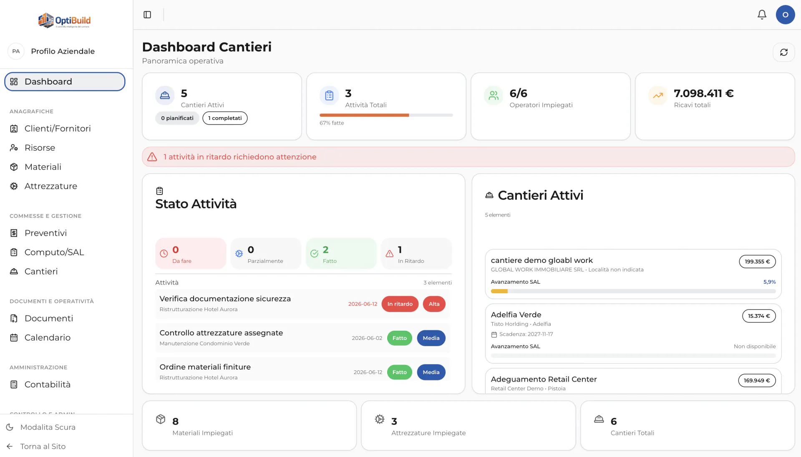

# OptiBuild — intelligent construction-site management

> A platform that digitises the operational, technical and administrative side of a construction
> site: costs, accounting, work-progress statements, quantity takeoffs, documents, resources and
> dashboards.

**Role**
Architecture · Data Layer · Management Modules · API Integrations · AI Document Parsing

**Status**
In production · Presented at **Edil Expo 2026** in Rome.

---

## The problem

A construction site produces a large amount of structured information that almost nobody keeps
structured. The quantity survey — the *computo metrico* — is the document that defines what will
be built and what it costs, and it routinely runs past 500 pages. It arrives as a PDF or an
exchange file, gets read by a human, and is then retyped into spreadsheets that immediately
diverge from the accounting, from the work-progress statements and from what is actually
happening on site.

Everything downstream inherits that gap: costs drift from estimates, progress statements are
reconstructed after the fact, and nobody can answer "where is this job, right now" without
assembling it by hand.

## What I built

The platform closes the loop between the document that defines the work and the modules that
run it. A quantity survey is uploaded once, parsed into line items with quantities and
references, and from that moment the same structured data drives quotes, costing, materials,
resources, progress statements and the dashboards — instead of being retyped into each of them.

Around that spine sit the modules a site actually needs day to day: jobsites, quotes, materials
and equipment, people and their assignments, the document archive, and the administrative side
through to invoicing.

## Key capabilities

- **Quantity-survey ingestion** — PDF and exchange-format documents parsed into line items,
  quantities and references, at document lengths that make manual entry impractical.
- **Costing and quotes** — estimates built from parsed items, with AI-assisted suggestions when
  composing a quote from the survey.
- **Work-progress statements and accounting** — progress measured against the same structured
  items the job was costed on.
- **Jobsites, materials, equipment and people** — the operational records, with assignment and
  scheduling.
- **Document archive** — site documentation kept alongside the job it belongs to.
- **Mobile builds** — the same application shipped as iOS and Android builds, with geolocation
  for on-site use.
- **Administrative output** — PDF generation, QR codes and electronic invoicing.
- **Dashboards** — active sites, activities, assigned operators, revenue and progress per job.

## Architecture

Client over a token-authenticated API, domain services over a relational store. The hard part is
the document-AI layer and one costing model shared across seven modules.

## Engineering decisions

**One structured source, many modules.** The parsed survey is the single representation of the
work. Quotes, costing, progress statements and dashboards read from it rather than each holding
their own copy. It is the decision that makes the numbers agree, and it constrains every module
that came afterwards.

**Parsing split between Python and the application.** Page counting and chunk extraction happen
in a small Python step over the PDF; interpretation happens in the application layer. Splitting
mechanical extraction from semantic interpretation keeps the AI step working on clean, bounded
input instead of raw bytes, and makes a parsing failure diagnosable.

**Chunking before interpretation.** A 500-page survey cannot be handed to a model in one piece.
Documents are segmented first, so the expensive step runs on units that fit and can be retried
individually.

**Permissions at the data layer.** A new endpoint cannot widen what a role can see. The UI
reflects the rule.

**Same application on mobile.** The site-facing build is the web client packaged natively, so both
stay in step.

## AI in the product

- **Document parsing** of quantity surveys, from long PDFs and industry exchange formats into
  structured line items.
- **Costing suggestions** when a quote is composed from a parsed survey.
- **Conversational assistance** inside the application.

The AI produces structured data that a human reviews inside the normal workflow, before financial
records are committed.

## Security and privacy

Access is role-scoped at the data layer, with an audit trail over the operations that matter.
Environments are separated, and site documents — which are commercially sensitive — live behind
the same access rules as the records they belong to. Client data, endpoints and infrastructure
details are deliberately not described here.

## Stack

**Frontend**
React · Vite · Radix UI

**Backend**
Laravel · PHP 8.2

**Mobile**
Capacitor · iOS · Android

**AI / Parsing**
Python · Quantity-survey parsing · PDF and DCF extraction

**Data**
Relational data layer · Role-scoped access · Audit trail

**Output**
PDF generation · QR codes · E-invoicing

**Tooling**
Playwright

## Result

The platform is in production and was presented at **Edil Expo 2026** in Rome. The data layer
carries **170+ tables with row-level security across 8 roles and an audit trail**, and the
document pipeline handles quantity surveys of **500+ pages**.

No further metrics are published here: what is not measured is not claimed.

## Source code

The source code is maintained in a private repository: OptiBuild is a commercial product with
client-specific implementation details. This repository documents the architecture, the
engineering decisions and the product work.

## Links

- **Interactive case study** — [francescoiaforte.vercel.app/en/projects/optibuild](https://francescoiaforte.vercel.app/en/projects/optibuild)
- **Profile** — [github.com/francescoveryra-dot](https://github.com/francescoveryra-dot)
- **Full portfolio** — [francescoiaforte.vercel.app](https://francescoiaforte.vercel.app)
